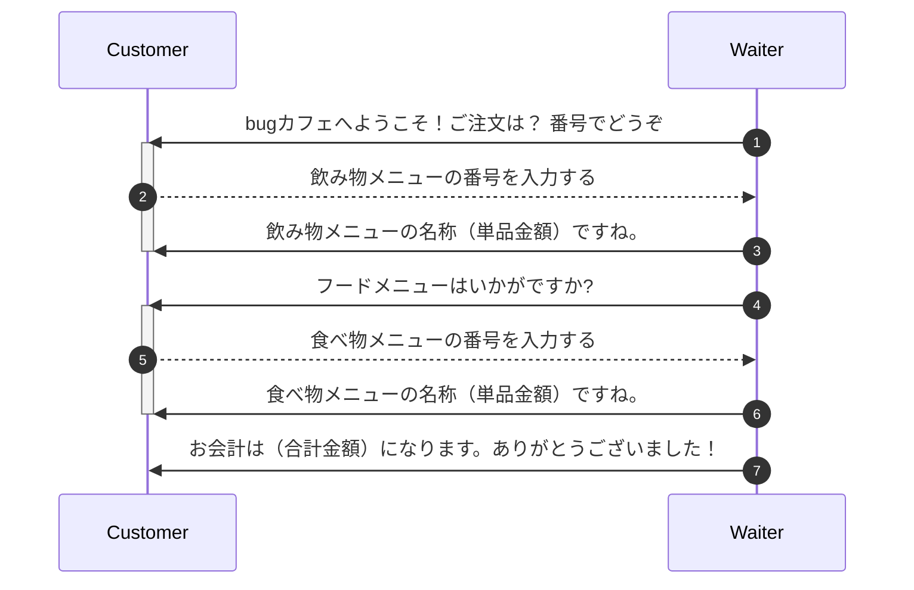
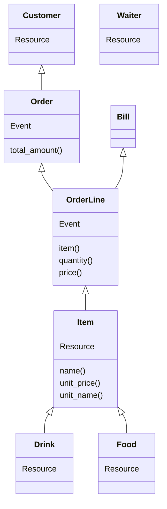

# NOTE

## 登場人物

- 顧客＜Customer＞
  - 要求: 食事をしたい、それは生命維持に必要だからだ
  - 要件: メニューから飲み物と食べ物を注文できること
- 接客業務を担当する従業員＜Waiter＞
  - 要求: 顧客からの注文を記録したい、それは厨房に伝えるために必要だからだ
  - 要件: 顧客からの注文を自動で記録できること

## 活動

## 主要エンティティ

[イミュータブルデータモデル - kawasima](https://scrapbox.io/kawasima/%E3%82%A4%E3%83%9F%E3%83%A5%E3%83%BC%E3%82%BF%E3%83%96%E3%83%AB%E3%83%87%E3%83%BC%E3%82%BF%E3%83%A2%E3%83%87%E3%83%AB) の手順で整理する。

### Step1. エンティティを抽出する

- <u>顧客</u> は <u>メニュー</u> をもとに、 <u>飲み物</u> と <u>食べ物</u> ごとに割り当てられた番号で <u>注文</u> する
- <u>従業員</u> は顧客が注文したメニューの番号から <u>注文品</u> の<u>名称と単品金額</u> を <u>通知</u> する
- 従業員は注文が確定したあとに、 顧客に<u>合計金額</u> を <u>請求</u> する

|5W1H |エンティティ候補                 |
|:----|:--------------------------------|
|Who  |顧客、従業員                     |
|What |メニュー、飲み物、食べ物、注文品 |
|When ||
|Where||
|Why  |注文、請求                       |
|How  ||

### Step2. エンティティを分類する

- Who, What, When, Where: リソース
- Why, How: イベント

### Step3. イベントエンティティには1つの日時属性しかもたないようにする

今回はなし

### Step4. リソースに隠されたイベントを抽出する

今回はなし

## リソース[R]とイベント[E]を図にする

